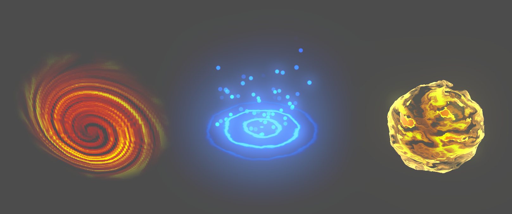
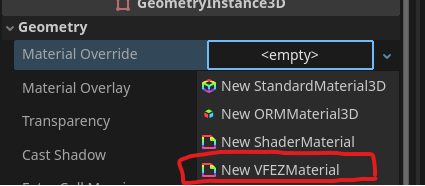
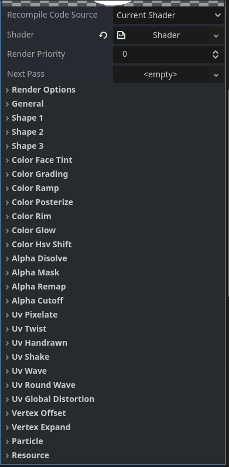

# VFEZ-godot

VFEZ-godot includes a flexible godot material for easy VFX generation. VFEZ-godot was tested in Godot 4.3.

To create a `VFEZ-material` simply clone the repository inside your project, then create a new material and select `New VFEZMaterial`.

A `VFEZMaterial` contains various effects that can be stacked easily without writing a single line of code. Multiple shapes can also be stacked to create complex effects.

## Technical details
A `VFEZMaterial` dynamically recompiles the `vfez_template.gdhader` every time an option is selected. That way the resulting material does not include excess code logic and is performant. Every `VFEZMaterial` includes a copy of the original template shader. By selecting `Recompile Code Source` at the top of the material, you can decide whether every new recompilation will use the material's current clone or the original template as a source. 

* Using the current shader clone is useful when you want the material to be robust and not change with `vfez_template.gdhader` changes.
* Using the original `vfez_template.gdhader` template is useful when you want to make changes to the template and update all materials with it.

It is generally not recommended to change `vfez_template.gdhader` mindlessly as it can corrupt other materials.

## TODO
* Add more VFX examples
* Add more VFEZ effects
* Add more usage tutorials
* Cleanup `vfez_template.gdshader`
