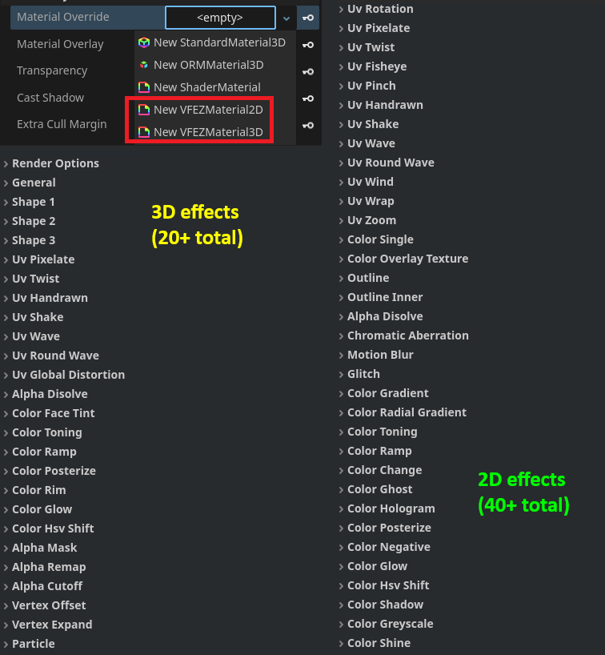

# VFEZ-godot

`VFEZ-godot` is a godot library for easy VFX generation. \
`VFEZ-godot` provides flexible `2D` and `3D` materials that can create complex effects without writing code.

## Quickstart
To get started with `VFEZ-godot` simply clone it inside your project and then create a new Material. \
To create a 3D VFX, create a `VFEZMaterial3D` in a `MeshInstance3D` node. \
To create a 2D VFX, create a `VFEZMaterial2D` in a `Sprite2D` or `TextureRect` node.
`VFEZ-godot` contains a big library of shader effects that can be stacked easily together.

## Technical details
A `VFEZMaterial` dynamically recompiles the `vfez_template.gdshader` every time an effect is enabled or disabled. That way the resulting material does not include excess code logic and is performant. Every `VFEZMaterial` includes a copy of the original template shader. By selecting `Recompile Code Source` at the top of the material, you can decide whether every new recompilation will use the material's current clone or the original template as a source. 

* Using the current shader clone is useful when you want the material to be robust and not change with `vfez_template.gdshader` changes.
* Using the original `vfez_template.gdshader` template is useful when you want to make changes to the template and update all materials with it.

It is generally not recommended to change `vfez_template.gdshader` mindlessly as it can corrupt other materials.

## TODO
* Add more VFX examples
* Add more VFEZ effects
* Add more usage tutorials
* Cleanup `vfez_template.gdshader`
